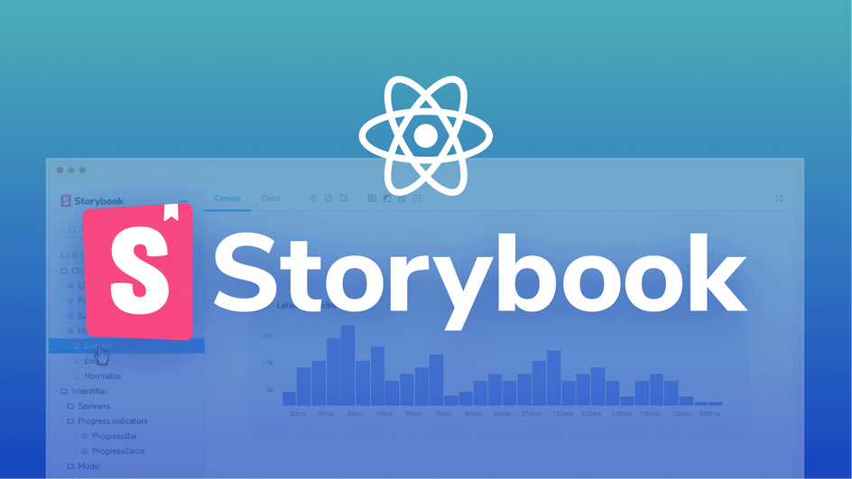
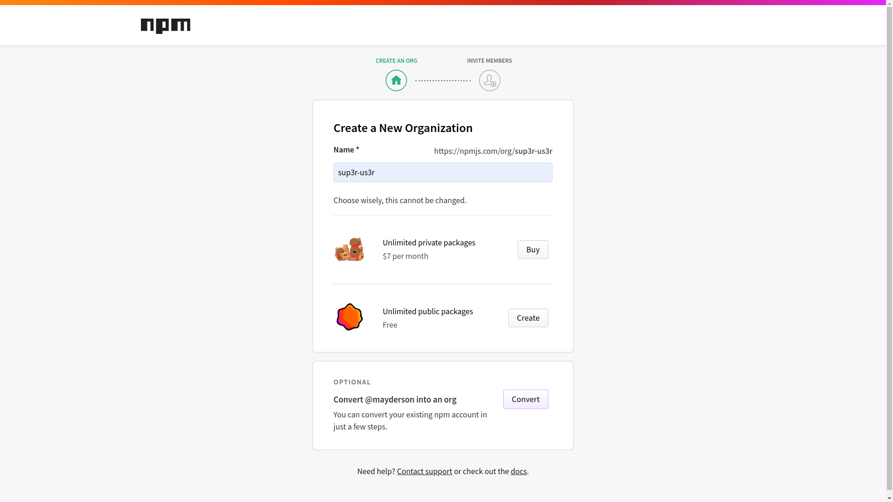
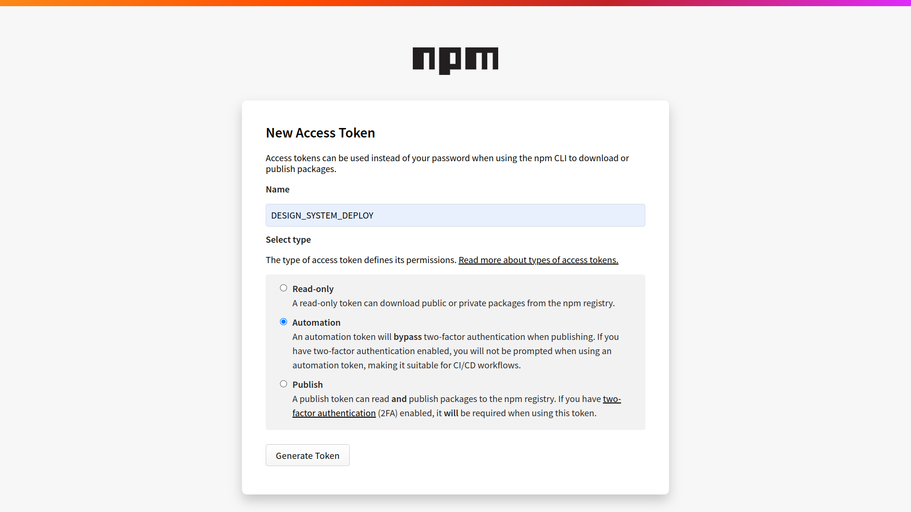
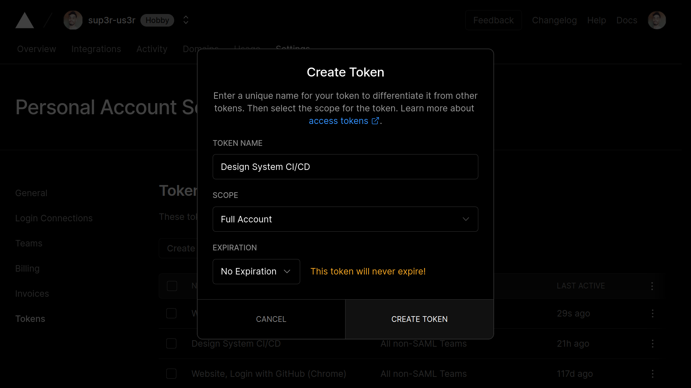

<p align="center">
  
</p>

# Design System

## Overview

This application is an example of creating and documenting a Design System using Storybook with Monorepo structure.

Access the Design System online through this [link](https://sup3r-us3r.github.io/design-system-with-storybook).

## Project structure

This project uses a Monorepo structure, basically there are 5 projects in only one repository, this helps a lot the codebase maintainability, the dependencies are centralized in the project root, and not in each individual package, with this structure it is possible to use another package as a dependency in a more simplified way.

Example of package structuring:

```text
├── design-system/
│   ├── packages/
│   │   ├── docs/
│   │   ├── eslint-config/
│   │   ├── react/
│   │   ├── tokens/
│   │   └── ts-config/
│   ├── package.json
│   ├── package-lock.json
│   └── turbo.json
```

## Turborepo

Turborepo is a smart build system for JavaScript/TypeScript monorepos: codebases containing multiple projects, often using multiple frameworks, in a single, unified code repository.

Using Turborepo, a `dev` script was created that **executes all packages** that have the same script in **parallel**, in addition, a `build` script was created that generates the **build of all packages** in an intelligent way, generating a cache so that the next build will be very fast.

See more:

- [Turborepo Docs](https://turborepo.org/docs)
- [Turborepo Installation](https://turborepo.org/docs/getting-started/existing-monorepo#create-a-pipeline)

## Changesets

Changesets is widely used when we have public packages that are going to be published in NPM, this tool helps to control the versioning of our monorepo, because as we have several packages in this project, and each one of them will be an individual package in NPM, and these packages can having different versions and different changelogs, that is, they are changes that happen over time in these packages, and controlling all this simply on GitHub is not so simple, because it ends up affecting all the project as a whole, but Changesets comes to help us in that.

See more:

- [Understanding Changesets](https://turborepo.org/docs/handbook/publishing-packages/versioning-and-publishing#understanding-changesets)
- [Changesets Installation](https://github.com/changesets/changesets/blob/main/packages/cli/README.md)
- [Changesets Action](https://github.com/changesets/action)

## Components

The components developed were these:

- [x] [Text](./packages/react/src/components/Text.tsx)
- [x] [Heading](./packages/react/src/components/Heading.tsx)
- [x] [TextInput](./packages/react/src/components/TextInput/index.tsx)
- [x] [TextArea](./packages/react/src/components/TextArea.tsx)
- [x] [Checkbox](./packages/react/src/components/Checkbox/index.tsx)
- [x] [Box](./packages/react/src/components/Box.tsx)
- [x] [Button](./packages/react/src/components/Button.tsx)
- [x] [Avatar](./packages/react/src/components/Avatar/index.tsx)
- [x] [MultiStep](./packages/react/src/components/MultiStep/index.tsx)

## Deploy setup

### NPM

You must have an NPM account to have packages published automatically, then you must create an organization in NPM so that your packages are linked to an organization.

To do this, access the NPM website and go to [Add Organization](https://www.npmjs.com/org/create)



Now it is necessary to generate a Token to be able to publish the packages using GitHub Actions, to generate a Token go to the `Access Token` option, and then click on `Generate New Token`, define the `Automation` type and then copy the Token that will be generated.



Now access your repository on GitHub go to `Settings` - `Secrets` - `Actions` - `New repository secret`.

Create a secret called `NPM_TOKEN` with the Token value copied earlier.

### Remote caching

To make the build faster, we can use a caching strategy that Turborepo provides, but since we are using an external CI/CD stream we need to send this cache somewhere, and [Vercel](https://vercel.com) has a free Turborepo integration, so we can send this cache, and so the next build will be much faster, the feature in question is Vercel Remote Caching.

To use this feature it is necessary to create 2 secrets on GitHub, then access your repository on GitHub go to `Settings` - `Secrets` - `Actions` - `New repository secret`, create the 2 secrets below:

- `TURBO_TOKEN`: A Vercel Access Token
- `TURBO_TEAM`: The slug of the Vercel team or username

To create the Access Token at Vercel is very simple, just access the `Settings` - `Tokens` tab or use this [link](https://vercel.com/account/tokens), now click `Create`, set a name for your Token, a scope and expiration date and click on `CREATE TOKEN`.



See more:

- [Vercel Remote Caching](https://vercel.com/docs/concepts/monorepos/remote-caching#use-remote-caching-from-external-ci/cd)

## Run packages

Install dependencies:

```bash
$ npm i
```

Run in development mode:

```bash
$ npm run dev
```

Run the local build:

```bash
$ npm run build
```
